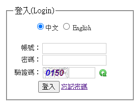
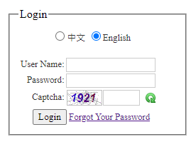
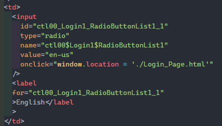
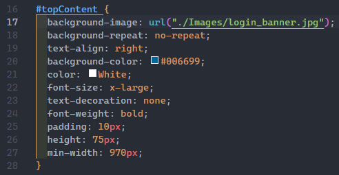
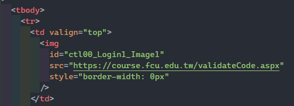
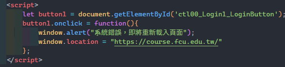
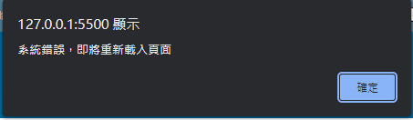
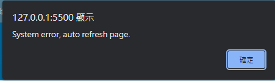

# 作業3 詐欺遊戲-釣魚網站

`
姓名: 張牧翔
學號: D1035899
`

- 目標網站: [https://course.fcu.edu.tw/](https://course.fcu.edu.tw/)
- 作業網站: [https://d1035899.github.io/HW3/](https://d1035899.github.io/HW3/)
- 說明網站: [https://d1035899.github.io/HW3/blob/master/README.md](https://d1035899.github.io/HW3/blob/master/README.md)
- Code Repo: [https://github.com/D1035899/HW3](https://github.com/D1035899/HW3)

---

## 目錄

- [作業3 詐欺遊戲-釣魚網站](#作業3-詐欺遊戲-釣魚網站)
  - [目錄](#目錄)
  - [目標網頁介紹](#目標網頁介紹)
  - [修改code講解](#修改code講解)
    - [刪除不需要的當案](#刪除不需要的當案)
    - [Radio button 轉換頁面](#radio-button-轉換頁面)
    - [下載檔案不完全](#下載檔案不完全)
    - [驗證碼](#驗證碼)
    - [使用者輸入帳號密碼之後續](#使用者輸入帳號密碼之後續)
  - [心得](#心得)

---

## 目標網頁介紹

該網頁為逢甲大學的選課系統登入介面，而學校會在即將開學期間，以及學期期中考前開放加退選，所以如果透過釣魚網站得到使用者的帳號密碼，就能將該學生的課程亂選一通，或是將他選的課變成自己的課。

---

## 修改code講解

### 刪除不需要的當案

這次的目標網站有很多用不到的js檔，因此經過測試之後，就將下載下來的js檔都刪除，並且將部分的`<script>`也刪除，因為不影響網頁使用上的問題。

### Radio button 轉換頁面

原本目標網站有兩種語言的頁面(中文/英文)，並且透過`Radio Button`來做轉換，但是因為在刪除檔案的時候好像也把該功能刪掉了，導致`Radio Button`點了之後不會有反應，因此就新增了新的`<script>`來做語言轉換。

>轉換語言的`Radio Button`

>透過偵測點擊`onclick`function來實現切換語言

### 下載檔案不完全

在下載原始網頁之後發現，有部分的圖片沒有顯示，後來才發現因為該圖片被放在原始的css檔案裡，因此就重新把圖片抓下來，就能正常顯示了。

>剛下載下來的樣子

>修改css以及下載漏掉的圖片後

>透過修改`#topContent`裡的`background-image`元素後，就能正常顯示了

### 驗證碼

由於下載下來之後，網頁的驗證碼圖片不會更新，因此我直接把原網站的驗證碼圖片位址複製到我修改的code裡，如此一來，驗證碼圖片就會隨著網頁整理而刷新。
而在驗證碼旁邊的刷新按鈕，也是因為在刪檔案的時候，不小心刪掉刷新功能，因此也實作了一個onclick來刷新驗證碼。

>驗證碼圖片位址以及按鈕樣式

### 使用者輸入帳號密碼之後續

在使用者輸入帳號密碼並點擊登入按鈕之後，會觸發`alertbox`提示，告知使用者網頁系統錯誤，然後重載頁面(實際上是將使用者導引回原本的網站)

>code實作

>網頁提示(中/英)

---

## 心得

我覺得這次的作業稍微有點麻煩，因為當你要復刻網站的時候，必須先把目標網頁的code抓下來分析他怎麼寫的。
而大部分的網站都做得很完善，所以在瀏覽code的時候會覺得很亂，不知道該從哪裡看，以及要刪除那些code。
後來發現只要邊看鱉comment一些code，看看那些code會不會有甚麼影響，如此一來，就能快速了解那些是不需要的部分。
透過這次的作業讓我的看code能力又更進步了一點。
